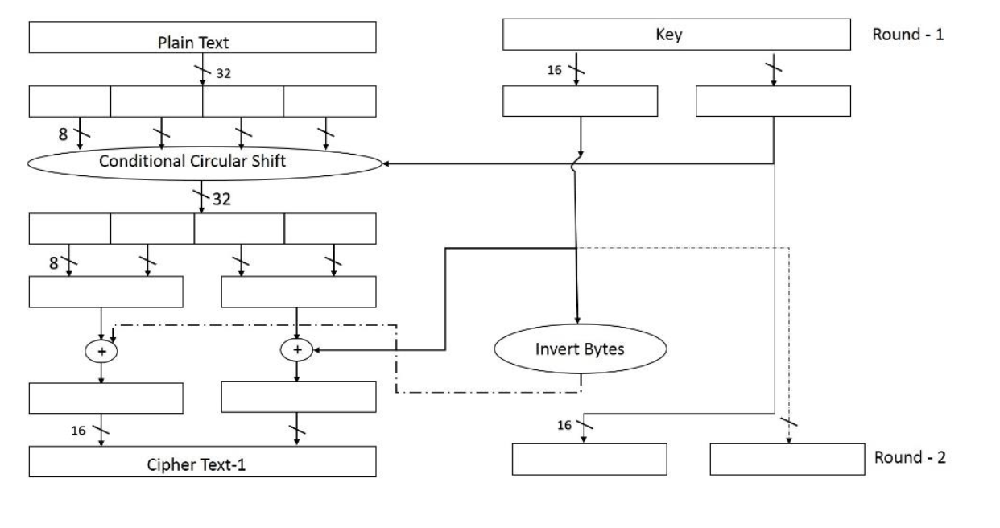
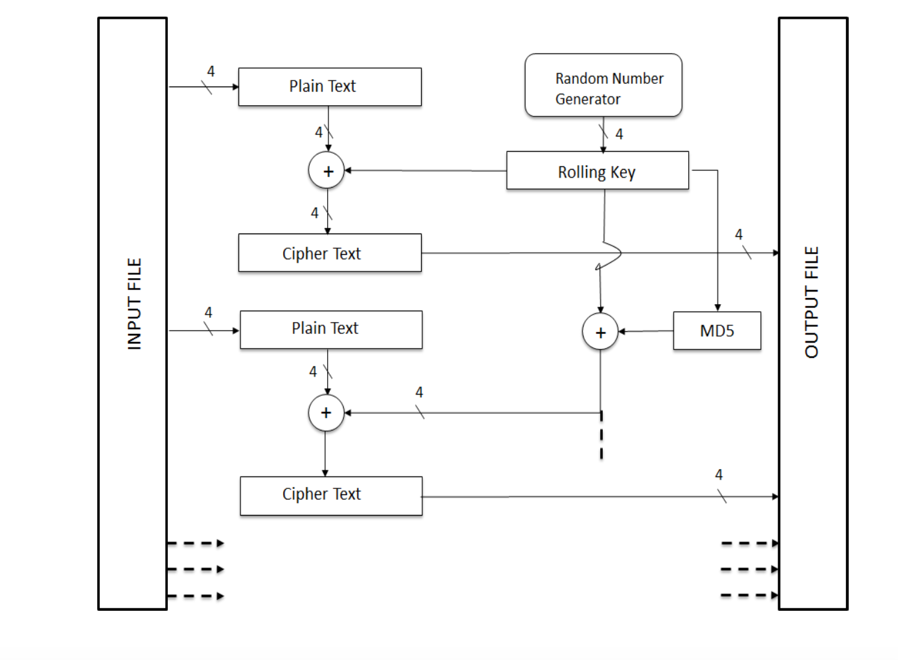

# Crypto Algorithms

Some Crypto exercises worked on during my Master's at ASU.

## 1 - Encryption Algorithm
- Encryption algorithm built as a function of a given text and a key.
- Ensures that the function is reversible given the key.
- Ensures that minute changes in the plain-text or key produce major changes in the cipher text.
- There's no name for the algorithm. An overview of the algorithm is in the image below.

- It's not very effective to brute-force attacks. But, is a good starting point to understand encryption algorithms.
- More details are in [The Report](01-encAlgo/Report.pdf)

## 2 - Breaking an Encryption algorithm
- Given an encrypted PDF file encrypted using an algorithm known to be susceptible to plaintext attacks.
- Reverse engineered the algorithm and figured out the weakness of the algorithm given the structure of a PDF file.
- And decrypted the file without a key or a brute-force attack. 
- The algorithm leaves the first 4 bytes of the plain text as it is in the cipher text illustrated in the below image.

- In a PDF, the first 4 bytes are %PDF. 
- Hence, breaking this with an attack is as simple as figuring out this fact. 
- More details are in [The Report](02-breakingEncryption/Report.pdf)

## 3 - Extracting passwords from Hashes
- Given a few hashes
    - Performs a brute force attack to extract the passwords for each of the hashes.
    - Constructs a rainbow table and extract the passwords using this appraoch too.
- More details are in [The Report](02-passwordsFromHashes/Report.pdf)
